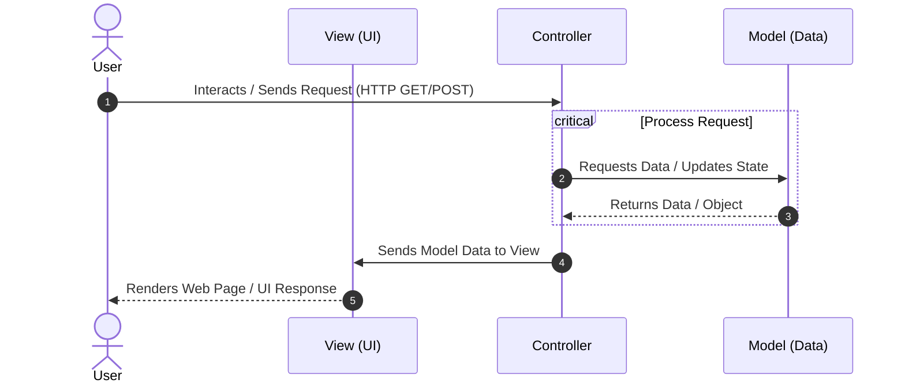

```mermaid
sequenceDiagram
    autonumber
    actor User
    participant V as View (UI)
    participant C as Controller
    participant M as Model (Data)

    User->>C: Interacts / Sends Request (HTTP GET/POST)
    critical Process Request
        C->>M: Requests Data / Updates State
        M-->>C: Returns Data / Object
    end
    C->>V: Sends Model Data to View
    V-->>User: Renders Web Page / UI Response
```
